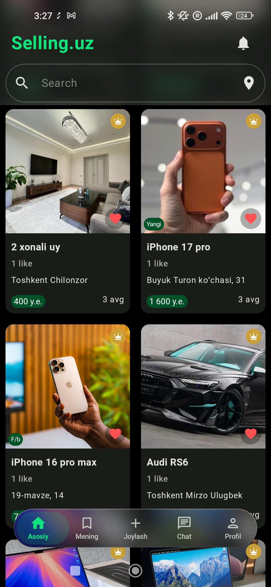
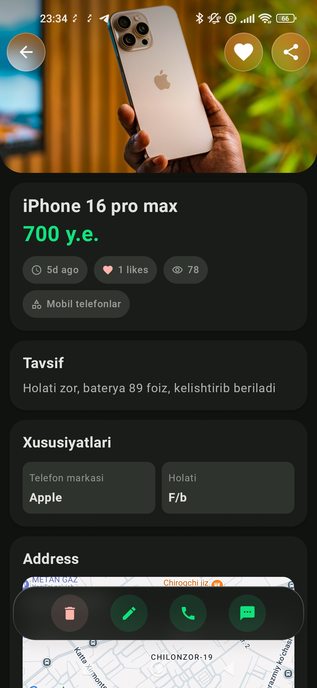
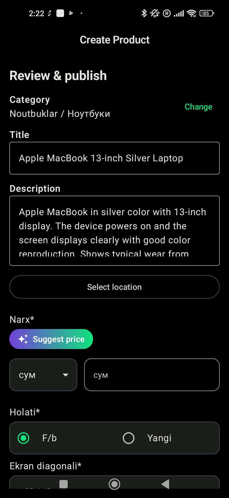
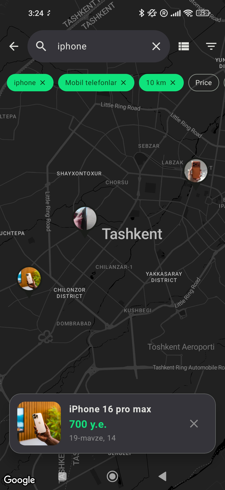
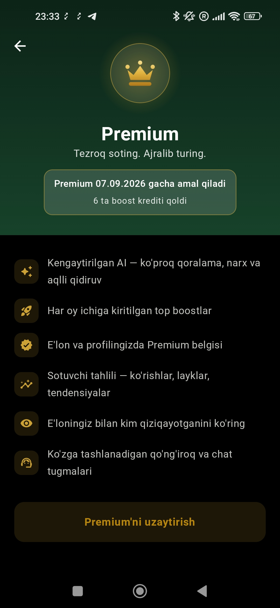
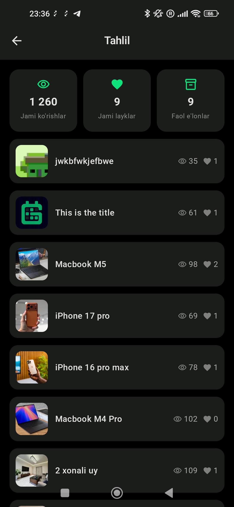
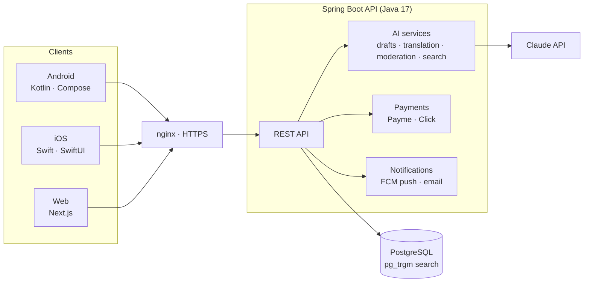

# Selling.uz

**AI-powered marketplace for Uzbekistan — buy and sell anything, in your language.**

[🌐 selling.uz](https://selling.uz) ·
[📱 Google Play](https://play.google.com/store/apps/details?id=uz.promo.selling) ·
[🍎 App Store](https://apps.apple.com/us/app/selling-uz/id6789182538)

*A product of [CODEUNIT LABS](https://codeunitlabs.uz)*

---

> **Note:** This is the public showcase of Selling.uz. The production codebase is
> private (commercial product); source access can be granted to evaluators on
> request — contact us below.

## About

Selling.uz is a full-stack classifieds marketplace built for the Uzbek market:
native Android and iOS apps, a web app, and a single backend — with an AI layer
that removes the friction of posting and finding listings.

What started ~4 years ago as a learning project (Spring Boot + a simple Android
client) grew into a complete product, live on every platform.

## Screenshots

| Home | Listing | AI creation |
|---|---|---|
|  |  |  |

| Map search | Premium | Seller analytics |
|---|---|---|
|  |  |  |

More in <a href="screenshots/">screenshots/</a>: search results, AI generation, chat, radius picker, profile, my ads.

## Key features

**Marketplace**
- Post listings with photos, category-specific fields, and map location
- Search with typo tolerance and cross-language matching (Uzbek ⇄ Russian ⇄ English)
- Radius search ("within 5 km of me"), filters, favorites, real-time chat
- Push + inbox notifications, saved-search alerts
- Listing boost and prepaid Premium membership, paid via **Payme** and **Click**

**AI layer (powered by Claude)**
- 📸 **Photo-to-listing** — seller adds photos, AI drafts the title, description, and category fields
- 🌍 **Automatic translation** — every post is stored in Uzbek, Russian, and English; buyers always read listings in their own language
- 🔎 **Natural-language search** — "cheap iPhone in Tashkent" just works
- 🛡️ **24/7 content moderation** — every new listing is AI-screened for scams and prohibited items
- 💰 **Price suggestions** — recommended price ranges from comparable listings

## Platforms

| Platform | Stack | Status |
|---|---|---|
| Android | Kotlin, Jetpack Compose | ✅ Live on Google Play |
| iOS | Swift, SwiftUI | ✅ Live on the App Store |
| Web | Next.js (React), SSR/ISR | ✅ Live at selling.uz |
| Backend | Java 17, Spring Boot, PostgreSQL | ✅ In production |

## Architecture

**Engineering choices worth noting**

- **Search without Elasticsearch** — PostgreSQL `pg_trgm` delivers typo-tolerant,
  cross-language, relevance-ranked search with zero extra infrastructure.
- **Translation pipeline** — posts are translated asynchronously on creation and
  served from a translations table, so reads stay fast and cheap.
- **AI moderation is advisory** — it flags listings for human review rather than
  auto-rejecting, keeping people in the loop.
- **On-demand cache revalidation** — backend mutations ping the web app's ISR
  webhook, so the site reflects changes in seconds while staying fully cached.

## Traction

<!-- TODO: fill in before submitting -->
- 📈 X listings posted · Y registered users · Z monthly active users
- 🏪 Live on Google Play and the App Store since 2026

## Company

**CODEUNIT LABS** — [codeunitlabs.uz](https://codeunitlabs.uz)

Legal pages: [Privacy policy](https://selling.uz/uz/privacy-policy) ·
[Terms of service](https://selling.uz/uz/terms-of-services)

## Contact

- 📧 jaloliddinabdullaev07@gmail.com
- 🌐 https://selling.uz

---

© CODEUNIT LABS. All rights reserved. This repository is a product showcase;
the source code of Selling.uz is proprietary.
