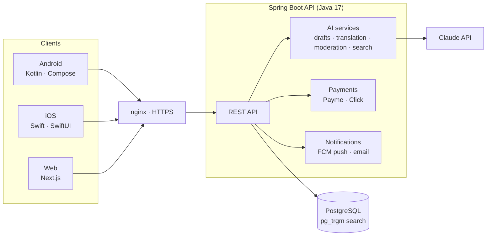

<div align="center">

# Selling.uz

**AI-powered marketplace for Uzbekistan — buy and sell anything, in your language.**

[🌐 selling.uz](https://selling.uz) ·
[📱 Google Play](https://play.google.com/store/apps/details?id=uz.promo.selling) ·
[🍎 App Store](https://apps.apple.com/us/app/selling-uz/id6789182538)

*A product of [CODEUNIT LABS](https://codeunitlabs.uz)*

</div>

---

> **Note:** This is the public showcase of Selling.uz. The production codebase is
> private (commercial product). Representative, unedited excerpts from it are in
> [Code excerpts](#code-excerpts) below, and read-only access to the private
> repositories is available to evaluators on request — see
> [Source access for evaluators](#source-access-for-evaluators).

## About

Selling.uz is a full-stack classifieds marketplace built for the Uzbek market:
native Android and iOS apps, a web app, and a single backend — with an AI layer
that removes the friction of posting and finding listings.

What started ~4 years ago as a learning project (Spring Boot + a simple Android
client) grew into a complete product, live on every platform.

## Screenshots


| Home | Listing | AI creation |
|---|---|---|
|  |  |  |

| Map search | Premium | Seller analytics |
|---|---|---|
|  |  |  |

<sub>More in <a href="screenshots/">screenshots/</a>: search results, AI generation, chat, radius picker, profile, my ads.</sub>

## Key features

**Marketplace**
- Post listings with photos, category-specific fields, and map location
- Search with typo tolerance and cross-language matching (Uzbek ⇄ Russian ⇄ English)
- Radius search ("within 5 km of me"), filters, favorites, real-time chat
- Push + inbox notifications, saved-search alerts
- Listing boost and prepaid Premium membership, paid via **Payme** and **Click**

**AI layer (powered by Claude)**
- 📸 **Photo-to-listing** — seller adds photos, AI drafts the title, description, and category fields
- 🌍 **Automatic translation** — every post is stored in Uzbek, Russian, and English; buyers always read listings in their own language
- 🔎 **Natural-language search** — "cheap iPhone in Tashkent" just works
- 🛡️ **24/7 content moderation** — every new listing is AI-screened for scams and prohibited items
- 💰 **Price suggestions** — recommended price ranges from comparable listings

## Platforms

| Platform | Stack | Status |
|---|---|---|
| Android | Kotlin, Jetpack Compose | ✅ Live on Google Play |
| iOS | Swift, SwiftUI | ✅ Live on the App Store |
| Web | Next.js (React), SSR/ISR | ✅ Live at selling.uz |
| Backend | Java 17, Spring Boot, PostgreSQL | ✅ In production |

## Architecture



**Engineering choices worth noting**

- **Search without Elasticsearch** — PostgreSQL `pg_trgm` delivers typo-tolerant,
  cross-language, relevance-ranked search with zero extra infrastructure.
- **Translation pipeline** — posts are translated asynchronously on creation and
  served from a translations table, so reads stay fast and cheap.
- **AI moderation is advisory** — it flags listings for human review rather than
  auto-rejecting, keeping people in the loop.
- **On-demand cache revalidation** — backend mutations ping the web app's ISR
  webhook, so the site reflects changes in seconds while staying fully cached.

## Code excerpts

A few short, unedited excerpts from the production backend (Java 17 · Spring Boot)
that show how the pieces above are actually built. Full source is available to
evaluators — see [Source access for evaluators](#source-access-for-evaluators).

<details open>
<summary><b>1 · Advisory AI moderation — async, never blocks publishing</b> (<code>ai/ModerationService.java</code>)</summary>

```java
/**
 * Advisory AI moderation, run asynchronously after a post is created so it never
 * blocks publishing. The verdict is only recorded on the post (clean/flagged +
 * reason) for the admin queue — it does NOT auto-approve or reject, so the
 * human approval flow is unchanged.
 */
@Service
@RequiredArgsConstructor
@Slf4j
public class ModerationService {

    private static final String SYSTEM_PROMPT = """
            You moderate classified-ad listings for a marketplace in Uzbekistan.
            Decide if the listing is clean and safe to show, or should be flagged for human review.
            Flag for: scams, payment-before-meeting requests, prohibited/illegal items, weapons/drugs,
            offensive or hateful text, obvious spam/duplicate filler, or phone-number/contact abuse.
            Be conservative: only flag when there is a concrete reason. Reply with the structured verdict.
            """;

    private final AiClient aiClient;
    private final PostRepository postRepository;

    @Async
    @Transactional
    public void reviewAsync(Long postId) {
        Post post = postRepository.findById(postId).orElse(null);
        if (post == null) return;

        String userText = "Title: " + safe(post.getTitle()) + "\n"
                + "Description: " + safe(post.getDescription()) + "\n"
                + "Address: " + safe(post.getAddressName()) + " " + safe(post.getAddressDescription());
        try {
            ModerationVerdict verdict =
                    aiClient.completeStructured(SYSTEM_PROMPT, userText, null, ModerationVerdict.class);
            post.setAiModerationStatus(verdict.clean() ? "clean" : "flagged");
            post.setAiModerationReason(verdict.clean() ? null : verdict.reason());
            postRepository.save(post);
            if (!verdict.clean()) {
                log.warn("Post {} flagged by AI moderation: {}", postId, verdict.reason());
            }
        } catch (Exception e) {
            // Moderation must never break the listing; just log and leave it for a human.
            log.warn("AI moderation failed for post {}: {}", postId, e.getMessage());
        }
    }
}
```

`aiClient.completeStructured(...)` is a thin wrapper over the Claude API that
returns a typed Java record (`ModerationVerdict(boolean clean, String reason)`),
so the model's output is schema-validated before it touches the database.

</details>

<details>
<summary><b>2 · Cross-language, typo-tolerant search on plain PostgreSQL</b> (<code>posts/PostRepository.java</code>, <code>config/SearchIndexInitializer.java</code>)</summary>

The search query runs against the post's own text **and** its uz/ru/en
translations, so a query in one language finds posts written in another, in any
word order. `pg_trgm` adds typo tolerance and relevance ranking — no
Elasticsearch to operate. Boosted listings stay on top; user-selected sorts
(price, popularity) override relevance.

```sql
SELECT * FROM _posts
WHERE status = :status
  AND (:query = ''
       -- every query token must appear in the post text OR any translation
       OR LOWER(title || ' ' || COALESCE(description,'') || ' ' ||
                COALESCE((SELECT string_agg(t.title || ' ' || COALESCE(t.description,''), ' ')
                          FROM post_translation t WHERE t.post_id = _posts.id), ''))
          LIKE ALL (string_to_array(:patterns, chr(31)))
       -- typo tolerance on titles (pg_trgm)
       OR word_similarity(LOWER(:query), LOWER(title)) > 0.42
       OR EXISTS (SELECT 1 FROM post_translation ts
                  WHERE ts.post_id = _posts.id
                    AND word_similarity(LOWER(:query), LOWER(ts.title)) > 0.42))
  -- "within N km of me" (haversine)
  AND (6371 * acos(LEAST(1.0, GREATEST(-1.0,
        cos(radians(:lat)) * cos(radians(latitude)) * cos(radians(longitude) - radians(:lon))
      + sin(radians(:lat)) * sin(radians(latitude)))))) < :radius
  AND (:priceMin IS NULL OR price >= :priceMin)
  AND (:priceMax IS NULL OR price <= :priceMax)
ORDER BY
  CASE WHEN is_prioritized = true AND prioritize_until > NOW() THEN 1 ELSE 2 END,   -- boosted first
  CASE WHEN :sort = 'price_asc'  THEN price      END ASC  NULLS LAST,
  CASE WHEN :sort = 'price_desc' THEN price      END DESC NULLS LAST,
  CASE WHEN :sort = 'popular'    THEN view_count END DESC NULLS LAST,
  CASE WHEN :query <> '' AND COALESCE(:sort,'') NOT IN ('price_asc','price_desc','popular') THEN
       GREATEST(similarity(LOWER(title), LOWER(:query)),
                COALESCE((SELECT MAX(similarity(LOWER(tr.title), LOWER(:query)))
                          FROM post_translation tr WHERE tr.post_id = _posts.id), 0))
  END DESC NULLS LAST,                                                               -- relevance
  created_date DESC
```

The extension and trigram GIN indexes are created idempotently at boot, so a
fresh environment needs no manual DB setup:

```java
@Component
@RequiredArgsConstructor
@Slf4j
public class SearchIndexInitializer implements ApplicationRunner {

    private final JdbcTemplate jdbcTemplate;

    @Override
    public void run(ApplicationArguments args) {
        execute("CREATE EXTENSION IF NOT EXISTS pg_trgm", "...");
        execute("CREATE INDEX IF NOT EXISTS idx_posts_title_trgm ON _posts USING gin (LOWER(title) gin_trgm_ops)", "...");
        execute("CREATE INDEX IF NOT EXISTS idx_posts_description_trgm ON _posts USING gin (LOWER(description) gin_trgm_ops)", "...");
        execute("CREATE INDEX IF NOT EXISTS idx_post_translation_title_trgm ON post_translation USING gin (LOWER(title) gin_trgm_ops)", "...");
        execute("CREATE INDEX IF NOT EXISTS idx_post_translation_description_trgm ON post_translation USING gin (LOWER(description) gin_trgm_ops)", "...");
    }

    private void execute(String sql, String failureMessage) {
        try { jdbcTemplate.execute(sql); }
        catch (Exception e) { log.error("{}: {}", failureMessage, e.getMessage()); }
    }
}
```

</details>

<details>
<summary><b>3 · Auto-translation pipeline — write async, read with fallback</b> (<code>ai/TranslationService.java</code>)</summary>

```java
/**
 * Auto-translates listings into Uzbek / Russian / English so a post written in
 * one language is visible to all. Generation runs async after create/edit (never
 * blocks publish); reads fall back to the original text when no translation
 * exists yet (or the call failed).
 */
@Service
@RequiredArgsConstructor
@Slf4j
public class TranslationService {

    private static final String SYSTEM_PROMPT = """
            You translate marketplace listing text. Given a title and description in any language,
            produce natural, concise translations into Uzbek (Latin script), Russian, and English.
            Preserve the original meaning exactly. Do not add, embellish, or invent details, and do
            not include phone numbers or contact info. Keep product names/brands as-is.
            """;

    private final AiClient aiClient;
    private final PostRepository postRepository;
    private final PostTranslationRepository translationRepository;

    /** Effective title/description for a viewer's language, original as fallback. */
    public record Localized(String title, String description) {}

    public Localized localize(Long postId, String originalTitle, String originalDescription, String lang) {
        return translationRepository.findByPostIdAndLang(postId, lang)
                .filter(t -> t.getTitle() != null && !t.getTitle().isBlank())
                .map(t -> new Localized(
                        t.getTitle(),
                        (t.getDescription() == null || t.getDescription().isBlank())
                                ? originalDescription : t.getDescription()))
                .orElse(new Localized(originalTitle, originalDescription));
    }

    @Async
    @Transactional
    public void translateAsync(Long postId) {
        Post post = postRepository.findById(postId).orElse(null);
        if (post == null || post.getTitle() == null || post.getTitle().isBlank()) return;

        String userText = "Title: " + post.getTitle() + "\nDescription: " + safe(post.getDescription());
        try {
            Translations t = aiClient.completeStructured(SYSTEM_PROMPT, userText, null, Translations.class);
            upsert(postId, "uz", t.uz());
            upsert(postId, "ru", t.ru());
            upsert(postId, "en", t.en());
        } catch (Exception e) {
            // Translation is best-effort; never break the listing. Reads fall back to original.
            log.warn("Translation failed for post {}: {}", postId, e.getMessage());
        }
    }
}
```

</details>

The same pattern — **AI as an async, best-effort, schema-validated side-process
that can never break the core flow** — is used for listing drafts, price
suggestions and natural-language search.

## Traction

<!-- TODO: fill in before submitting -->
- 📈 X listings posted · Y registered users · Z monthly active users
- 🏪 Live on Google Play and the App Store since 2026

## Company

**CODEUNIT LABS** — [codeunitlabs.uz](https://codeunitlabs.uz)

Legal pages: [Privacy policy](https://selling.uz/uz/privacy-policy) ·
[Terms of service](https://selling.uz/uz/terms-of-services)

## Source access for evaluators

The production source (Spring Boot backend, native Android app, native iOS app,
Next.js web app, admin panel) lives in private repositories because Selling.uz is
a commercial product with live payment integrations.

For programme juries, technical reviewers and due-diligence purposes we are glad
to provide **read-only access to the private repositories** (time-limited
collaborator invite, or a guided code walkthrough / screen-share) on request.
Please e-mail the address below with your GitHub username and the purpose of
the review — access is normally granted within one business day.

## Contact

- 📧 jaloliddinabdullaev07@gmail.com
- 🌐 https://selling.uz

---

© CODEUNIT LABS. All rights reserved. This repository is a product showcase;
the source code of Selling.uz is proprietary.
